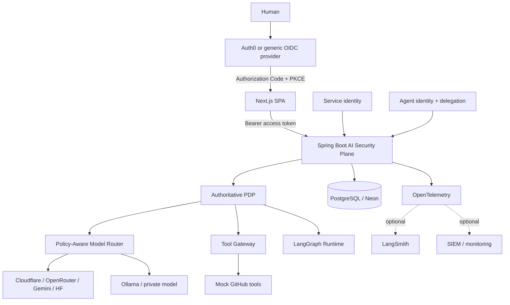
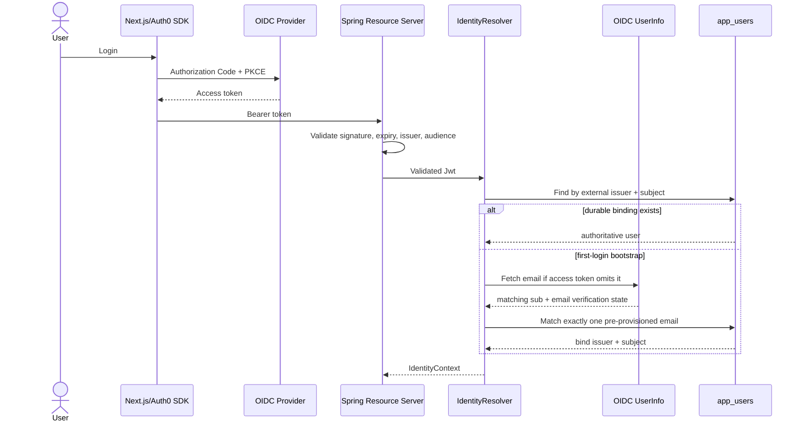
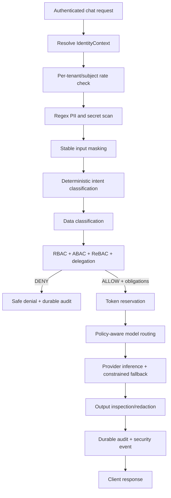
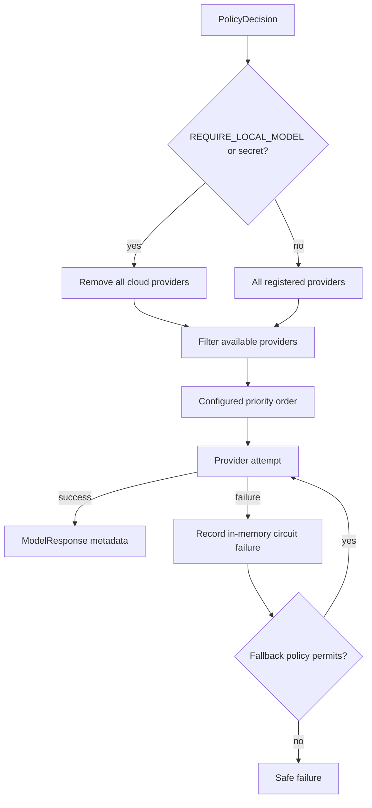
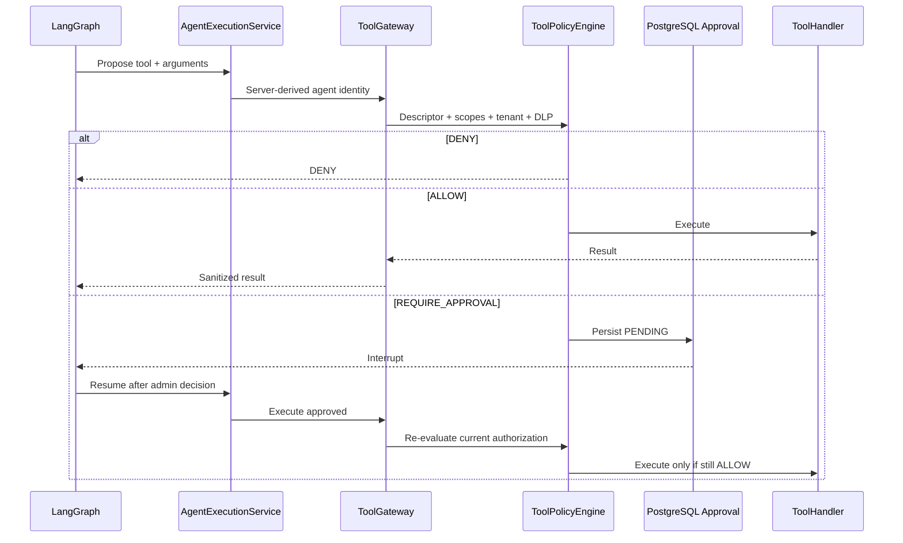

# Friday Architecture Deep Dive

> Implementation baseline: 27 August 2026
> Repository: `ai-iam-gateway`

## 1. Purpose

Friday is an identity-aware security and authorization control plane placed between enterprise identities, applications, AI models, agent runtimes and tools. It does not replace an identity provider, model provider or agent framework.

```text
Identity providers authenticate.
Models reason.
Agent runtimes orchestrate.
Tools execute.
Friday authorizes, constrains and records.
```

The implemented system has three cooperating planes:

| Plane | Responsibility | Authority |
|---|---|---|
| AI Security Plane | Identity reconciliation, DLP, policy, model routing, tool authorization and audit | Spring Boot + PostgreSQL |
| Agent Execution Plane | Workflow state, steps, interrupts and resumptions | LangGraph, subject to Spring decisions |
| Observability Plane | Operational traces, metrics, evaluation and security-event export | Micrometer/OTEL; optional LangSmith/SIEM |

PostgreSQL/Neon is the authoritative store for application users, request audit records, agent runs and approvals. Operational traces are not authorization records.

## 2. System context



## 3. Trust boundaries

### 3.1 Browser boundary

The browser is untrusted for authorization attributes. It supplies an access token and request content, but it cannot authoritatively specify:

- application role
- tenant
- clearance
- identity type
- agent identity
- delegation
- tool scopes
- approval state

The frontend stores production Auth0 access tokens in SDK-managed memory. Provider credentials, database credentials and the internal agent-runtime token remain server-side.

### 3.2 OIDC boundary

Auth0 is the current hosted identity provider, but authorization code is provider-neutral. Spring Security validates:

1. token signature through issuer/JWKS discovery;
2. expiration and standard temporal constraints;
3. exact issuer;
4. configured audience.

Only a successfully validated `Jwt` reaches `IdentityResolver`.

### 3.3 Local authorization boundary

External claims are authenticated inputs, not final permissions. PostgreSQL remains authoritative for:

- enabled/disabled status;
- application role;
- tenant membership;
- durable external identity binding.

### 3.4 Model boundary

Models receive masked, policy-approved context. Model text has no authorization meaning and cannot approve a tool, change a role or expand delegation scopes.

### 3.5 Agent-runtime boundary

The Python runtime receives only a run identifier and uses a shared server-to-server credential. Spring reloads the persisted run context for every inference and tool callback. Client-provided agent roles or tenants are never accepted.

### 3.6 Tool boundary

Agents cannot invoke a `ToolHandler` directly. Every proposal traverses registry lookup, argument inspection, tenant/scope/role policy, risk evaluation, optional durable approval and result sanitization.

## 4. Authentication and identity reconciliation



`IdentityContext` contains subject, normalized email, tenant, effective role, identity type, delegator, scopes, groups and ABAC attributes.

### Identity invariants

- A durable `(external_issuer, external_subject)` binding is the stable external identity key.
- Mutable email claims are not re-used to authorize an already-bound subject.
- A first-login email bootstrap must match exactly one local user.
- A disabled local user is denied even with a valid OIDC token.
- An asserted tenant mismatch is denied.
- External role claims never override the database role.
- OIDC and development-token modes are mutually exclusive.
- Production defaults to verified-email bootstrap.

The hosted synthetic-user demo can disable verified-email bootstrap through configuration. That exception is not the recommended production posture.

## 5. Direct AI request lifecycle



The current chat contract extracts the last user message. Bounded server-managed conversation history is not yet implemented.

## 6. Input security

`RegexPiiDetector` deterministically detects and masks entities such as email, phone, IP address and credential patterns. Stable placeholders prevent the raw value from reaching the provider.

```text
admin@example.com -> [EMAIL_1]
8542098418        -> [PHONE_1]
12.12.12.123      -> [IP_ADDRESS_1]
recognized secret -> [API_KEY_1]
```

PII forces a deterministic `PII` classification. Secrets are classified as restricted and require a non-cloud provider. If no healthy local provider is eligible, routing fails closed.

The prompt-injection capability is currently deterministic classification, not a comprehensive semantic detector and not a retrieved-document scanner.

## 7. Policy Decision Point

The PDP consumes a `PolicyContext` rather than provider-specific inputs.

```json
{
  "effect": "ALLOW",
  "risk": "MEDIUM",
  "policyVersion": "2026-08-23.4",
  "reason": "default_allow",
  "obligations": [
    { "type": "MASK_INPUT", "parameters": {} },
    { "type": "INSPECT_OUTPUT", "parameters": {} },
    { "type": "LIMIT_OUTPUT_TOKENS", "parameters": { "tokens": "800" } },
    { "type": "MAX_COST_USD", "parameters": { "usd": "0.01" } }
  ]
}
```

### Evaluation order

1. Validate the policy context and tenant.
2. Validate delegation and effective scope.
3. Enforce tenant and relationship access.
4. Enforce requested-region compatibility where attributes exist.
5. Deny security/prompt-injection intent.
6. Apply deterministic role/domain rules.
7. Produce risk, reason, policy version and obligations.

### Implemented obligations

- `MASK_INPUT`
- `INSPECT_OUTPUT`
- `REQUIRE_LOCAL_MODEL`
- `REQUIRE_APPROVAL`
- `RECORD_AUDIT`
- `DISABLE_MEMORY`
- `LIMIT_OUTPUT_TOKENS`
- `MAX_COST_USD`
- `LIMIT_COST`

Not every obligation is backed by a complete subsystem. In particular, `DISABLE_MEMORY` is representational until a production memory service exists.

## 8. RBAC, ABAC, ReBAC and delegation

RBAC supplies domain restrictions for `ADMIN`, `ENGINEER`, `FINANCE` and `INTERN`. ABAC adds tenant, region, clearance, groups and arbitrary configured attributes. ReBAC provides a conservative tenant/owner/viewer/editor baseline.

Delegation tracks originator, current actor, tenant, scopes and expiry. Child grants must be a subset of parent scopes. Cross-tenant, expired and privilege-expanding delegation fails closed.

This is a working policy foundation, not yet a general-purpose relationship graph or policy-authoring language.

## 9. Model provider subsystem

All providers implement the same `ModelProvider` contract. The registry currently supports Cloudflare Workers AI, OpenRouter, Gemini, Hugging Face and Ollama, with isolated OpenAI and Anthropic adapters.



The executor opens a provider circuit after three failures for 60 seconds. Circuit state is process-local. Scheduled probes, persisted attempt history and optimization by measured capability, region, quality, cost and latency remain future work.

## 10. Output security and streaming

`OutputInspector` detects and redacts sensitive content in completed model output. The non-streaming path inspects before returning the response.

The SSE path has an explicit security limitation: provider chunks can be emitted before whole-response inspection finishes. The target design is:

```text
provider stream
  -> rolling buffer
  -> incremental DLP/classifier
  -> release safe chunks
```

High-risk classifications should instead use full-response buffering. Until that release gate is implemented, Friday must not claim leak-safe token streaming.

## 11. Agent execution plane

The Python runtime uses LangGraph for state, deterministic workflow transitions, SQLite checkpoints and approval interrupts. It requests all inference through Spring; it never calls Ollama or a cloud model directly.

Agent state includes request/tenant/agent identifiers, originator, delegation chain, effective scopes, messages, step count, maximum steps, pending tool call, approval state and a minimal security context.

The current PR-review trajectory is deterministic:

```text
github.readFile
-> github.searchCode
-> github.mergePullRequest
```

This proves the security and approval path; it is not a general autonomous planning engine.

## 12. Tool authorization and approval



The three GitHub handlers are deterministic mocks. A production adapter requires a GitHub App, repository-scoped installation tokens, explicit credential lifetime and real result normalization.

## 13. Persistence and tenancy

| Entity | Purpose | Tenant boundary |
|---|---|---|
| `app_users` | Authoritative user, role, enabled state and OIDC binding | Composite tenant/email identity plus tenant field |
| `audit_log` | Direct-request security outcome and provider metadata | Required tenant ID |
| `agent_run` | Origin, scopes, steps, provider and status | Tenant-scoped reads |
| `agent_approval` | Sanitized action, risk and decision lifecycle | Tenant-scoped and ADMIN-decided |

Audit records store metadata rather than prompts, tokens, credentials or raw PII. Current audit is durable but not yet hash-chained, signed or WORM-backed.

## 14. Audit and observability

Safe observations include request ID, tenant, identity type, intent, data classification, policy decision/version, provider/model, route reason and tool metadata. `AiTelemetry` truncates and removes control characters, but callers must still pass only approved metadata.

```text
Spring observations
  -> Micrometer / OpenTelemetry
  -> OTEL collector
     -> optional LangSmith
     -> optional monitoring/SIEM
```

LangSmith is useful for traces, evaluation and agent debugging. It is neither the PDP nor the audit system of record.

## 15. Failure behavior

| Failure | Behavior |
|---|---|
| Missing/invalid/expired/wrong-audience token | `401` |
| Valid token without an enabled local mapping | `403` |
| Tenant mismatch or delegation escalation | Deny |
| PDP or tool registry failure | Do not execute protected action |
| Required local provider unavailable | Safe failure; never cloud fallback |
| Eligible cloud provider failure | Ordered fallback only when configured/policy-eligible |
| Approval store unavailable | Do not execute approval-required tool |
| Authorization changes after approval | Re-check denies execution |
| Security-event exporter failure | Durable request behavior is contained and exporter failure is metered |
| Render free-tier cold start | Frontend calls can remain pending until Spring/Neon become ready |

## 16. Deployment topology

The current hosted demonstration is:

```text
Browser
  -> Vercel Next.js
  -> Auth0 OIDC
  -> Render Spring Boot
  -> Neon PostgreSQL
  -> configured cloud model providers
```

Local development uses Spring Boot, Next.js, PostgreSQL, Ollama and the Python LangGraph runtime. An OTEL collector and LangSmith export are optional.

Customer VPC and on-prem deployment are architectural targets, not packaged deployment products today.

## 17. Operational configuration

Important configuration groups:

- Identity: `OIDC_*`, `DEV_TOKEN_ENABLED`, `JWT_*`
- Browser boundary: `CORS_ALLOWED_ORIGINS`
- Providers: provider-specific tokens/models and `MODEL_PROVIDER_PRIORITY`
- Routing: `ALLOW_CLOUD_FALLBACK`, `PROVIDER_TIMEOUT_SECONDS`
- Usage: `RATE_LIMIT_PER_MINUTE`, `DEFAULT_TOKEN_BUDGET`
- Agent runtime: `AGENT_RUNTIME_URL`, `AGENT_RUNTIME_TOKEN`
- Telemetry: `AI_OBSERVABILITY_*`, `OTEL_EXPORTER_OTLP_TRACES_ENDPOINT`

Secrets must remain in deployment secret stores and must never be committed, returned to the browser or added to telemetry.

## 18. Production-readiness boundary

### Implemented and demonstrable

- hosted/generic OIDC JWT validation and authoritative local identity;
- deterministic input masking and intent classification;
- RBAC plus ABAC/ReBAC and delegation foundations;
- obligation-aware model selection and fail-closed local-only routing;
- provider registry, ordered fallback and basic circuit breaking;
- output inspection for completed responses;
- durable request audit, agent runs and approvals;
- LangGraph orchestration through the Spring security plane;
- mock tool authorization and approval revalidation;
- optional OTEL/LangSmith-compatible observability.
- tenant-scoped dashboard KPIs and a separate authoritative decision-log view;
- validated bulk user onboarding with server-assigned tenant and authoritative ABAC attributes;
- two-level MCP catalog governance: tenant-admin availability followed by per-user selection.

### Foundation or roadmap

- real GitHub/MCP/SaaS execution and scoped credential vending;
- RAG document/chunk authorization and retrieval provenance;
- production memory controls;
- incremental safe streaming;
- Redis/distributed rate and budget enforcement;
- distributed LangGraph checkpointing and runtime HA;
- provider quality/cost/latency optimization;
- tamper-evident audit and complete provenance graph;
- packaged VPC/on-prem enforcement nodes and enterprise SIEM adapters.

This boundary should be preserved in product documentation and external positioning.
