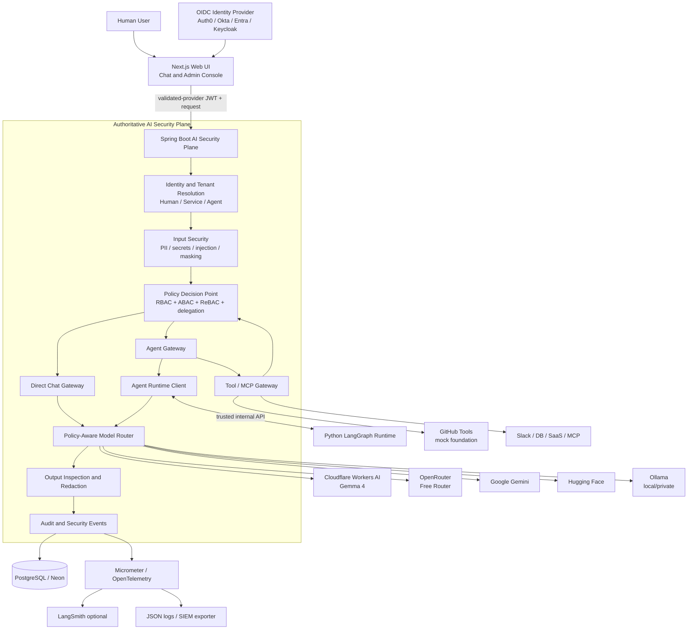
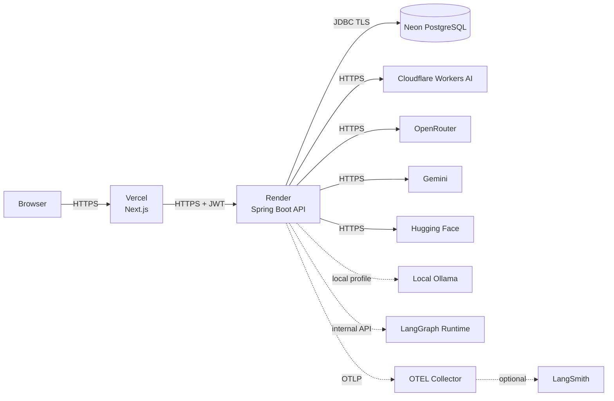
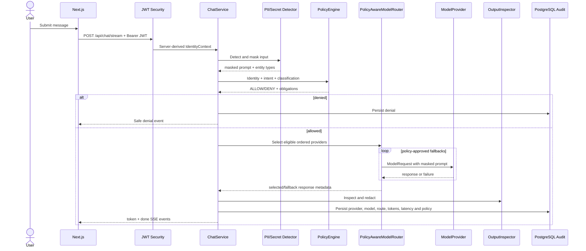
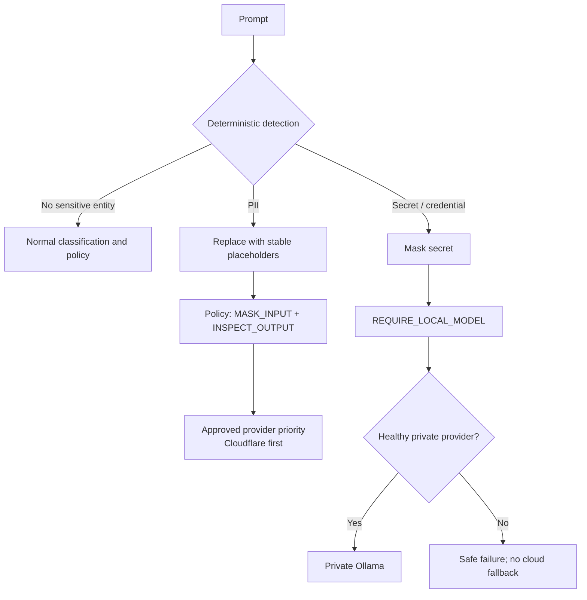
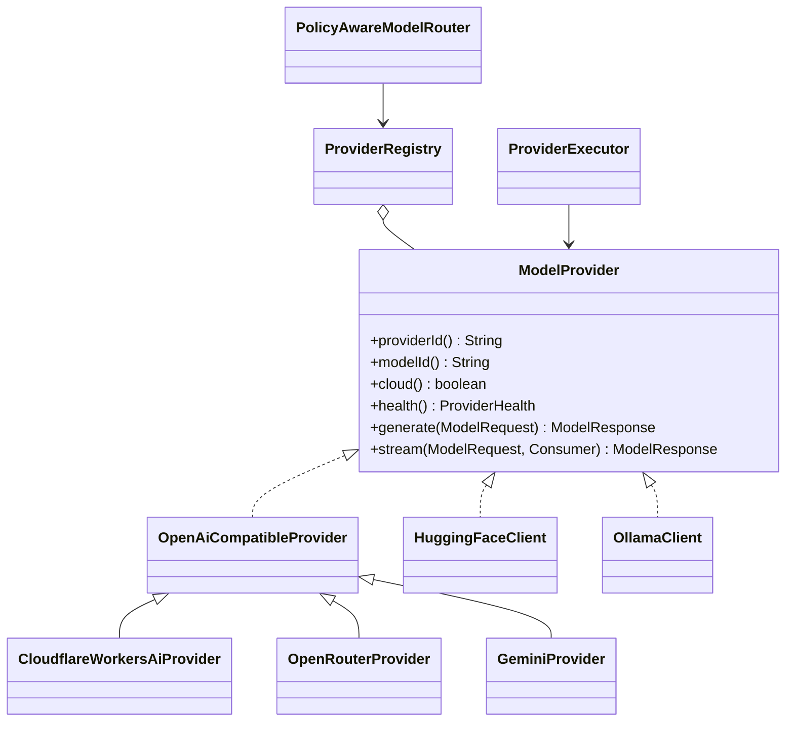
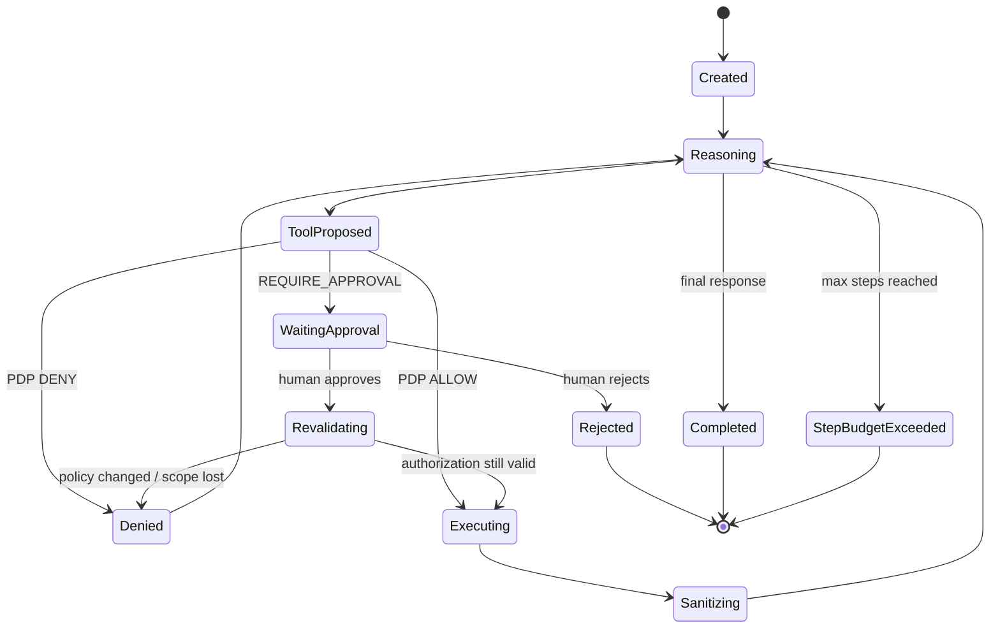
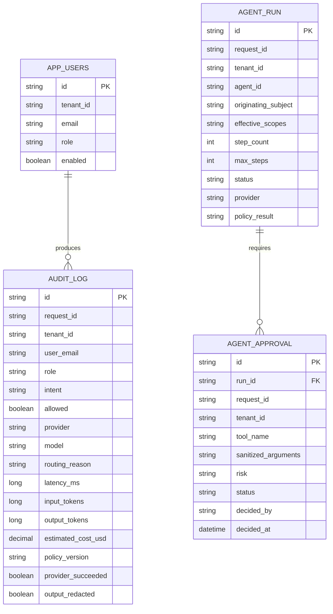

# AI Security Gateway — HLD and LLD

## Scope and architectural ownership

This service is an identity-aware AI security control plane. Spring Boot is the authoritative security plane. LangGraph orchestrates agent execution but never grants access. PostgreSQL is the security system of record. OpenTelemetry transports operational traces; LangSmith is optional observability and evaluation, not authorization or audit storage.

## High-level design



## Deployment view



## Hosted OIDC trust boundary

```mermaid
flowchart LR
    IdP[Generic OIDC Provider] -->|Authorization Code + PKCE| SPA[Next.js SPA]
    SPA -->|Bearer access token| ResourceServer[Spring Security Resource Server]
    ResourceServer -->|signature + expiry + issuer + audience valid| Mapper[Configurable claims mapper]
    Mapper --> Resolver[IdentityResolver]
    Resolver --> Users[(PostgreSQL / Neon app_users)]
    Users -->|authoritative tenant, enabled, role| Context[IdentityContext]
    Context --> PDP[ABAC / ReBAC / PDP]
```



OIDC claims provide authenticated identity attributes, not authorization decisions. The first hosted login binds one pre-provisioned, unambiguous email record to the validated `(issuer, subject)`. Cross-tenant assertions, disabled users and unknown mappings fail closed. Production SPA access tokens remain in SDK-managed memory and are never persisted by this application.

Production provider priority is `cloudflare, openrouter, gemini, huggingface, ollama`. Only healthy, policy-eligible providers participate. Local-only obligations exclude every cloud provider. Local development explicitly uses Ollama first.

## Direct-chat request sequence



### PII and secrets



Raw prompts, credentials, JWTs and unmasked PII must not enter telemetry or audit content. Audit stores classifications and metadata, not secret values.

## Provider-routing LLD



Routing algorithm:

1. Derive local-only restrictions from policy obligations and secret intent.
2. Remove providers that violate local/cloud restrictions.
3. Remove providers whose configured health is unavailable.
4. Sort eligible providers by configured priority.
5. Execute the first provider.
6. Use ordered fallbacks only when policy and `ALLOW_CLOUD_FALLBACK` permit them.
7. Circuit-break repeatedly failing providers.
8. Persist the actual provider and model, including fallback reason.

## Agent and approval flow



Every agent tool proposal follows registry lookup, argument DLP, scope check, tenant check, PDP evaluation, risk decision, optional persistent approval, execution and result sanitization. Approval never overrides policy; authorization is re-run before execution.

The demonstration repository is `imvaibhavm/ai-iam-gateway`. `github.mergePullRequest` is HIGH risk and requires an ADMIN approval. The current handler is deterministic/mock and does not merge a real pull request. The Admin Console links approval records to the repository/PR and retains decision history.

## Persistence model



Every query and record is tenant-scoped. PostgreSQL is authoritative for security audit and approval state. In-memory security-event summaries and LangSmith traces are operational views only.

## Observability hierarchy

```text
ai.request
├── ai.identity.resolve
├── ai.security.input_scan
├── ai.security.mask
├── ai.intent.classify
├── ai.policy.evaluate
├── ai.model.route
├── ai.model.inference
├── ai.security.output_scan
└── ai.audit.persist

ai.agent.run
├── ai.agent.step
├── ai.model.inference
├── ai.tool.propose
├── ai.tool.policy
├── ai.tool.execute
└── ai.agent.response
```

Safe correlation fields are `requestId`, `traceId` and `tenantId`. Trace identifiers are not authorization identifiers.

## Trust boundaries and failure rules

- Browser identity, tenant, role, clearance and agent claims are never trusted directly.
- JWT validation and server-side user lookup create the authoritative identity context.
- Cross-tenant access, delegation escalation and missing scopes fail closed.
- A model proposal has no authorization meaning.
- Approval-required tools cannot execute before approval and must be reauthorized afterward.
- Provider fallback cannot violate residency, local-only or other policy obligations.
- An unavailable required local model produces a safe failure, never a cloud fallback.
- Provider keys remain server-side environment secrets.
- PostgreSQL failure prevents authoritative audit-dependent operations from silently succeeding.

## Current limitations

- The direct chat UI sends only the latest user message; full multi-turn conversation history is not yet forwarded to providers.
- The SSE endpoint buffers provider output for final inspection, so the browser request remains pending until the inspected response is emitted.
- Ollama health currently reflects configuration rather than a remote connectivity probe.
- GitHub tools are deterministic mocks; a production GitHub App adapter and scoped installation token are still required.
- The development email-token endpoint is not production authentication and must be replaced by OIDC.
- LangSmith export is optional and must not be treated as the audit system of record.
