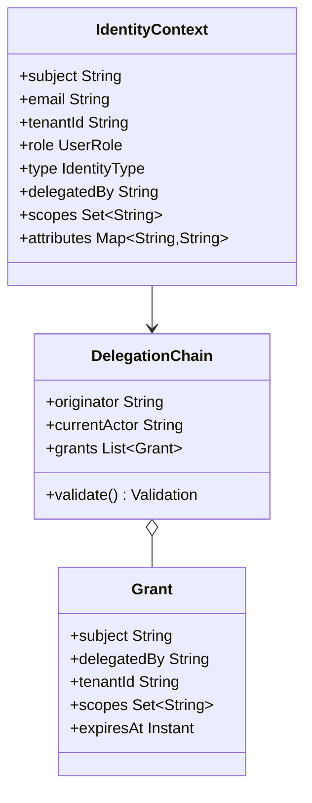
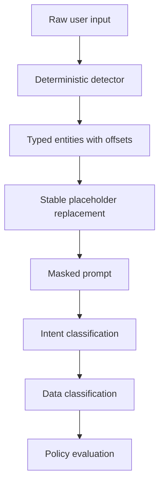
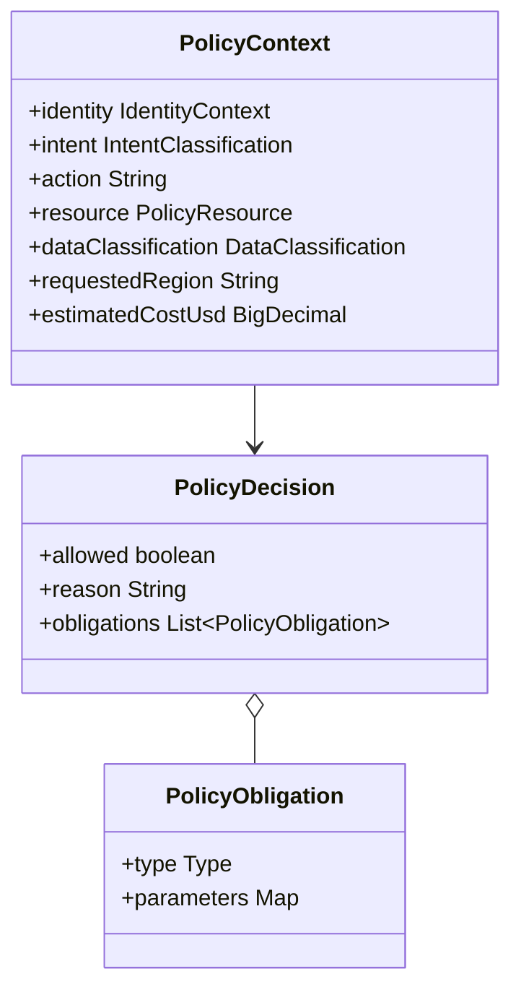
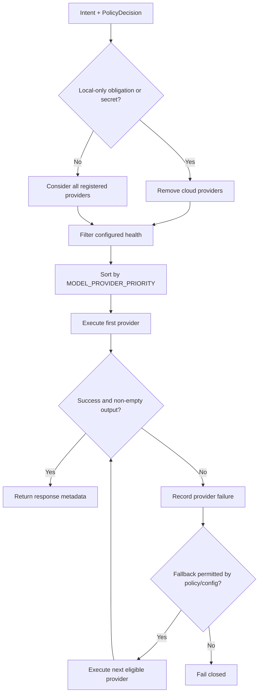
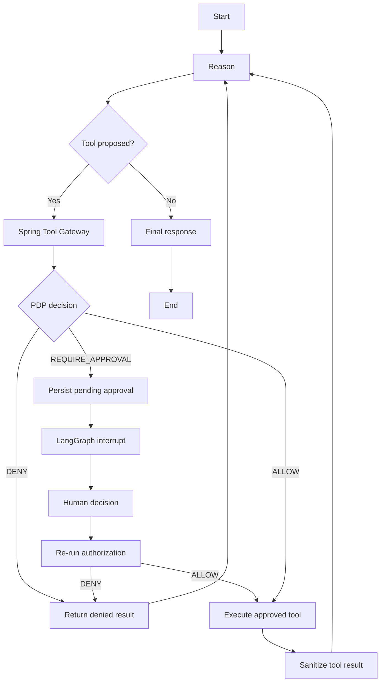
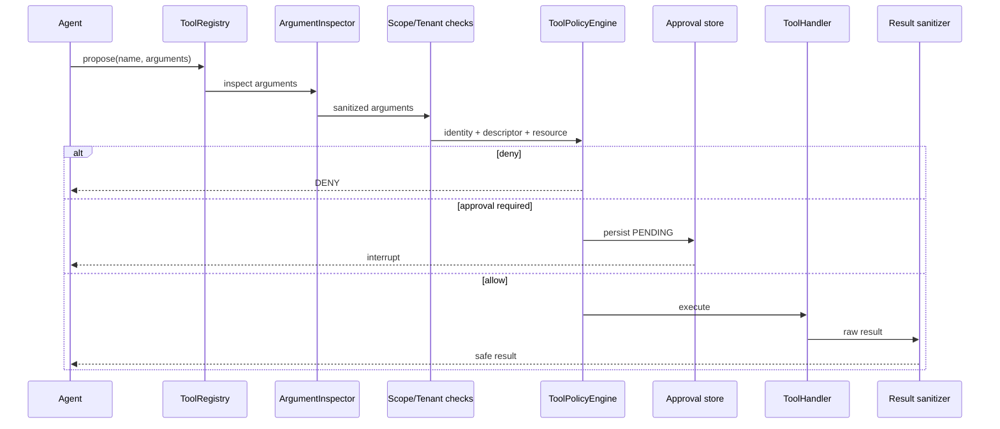
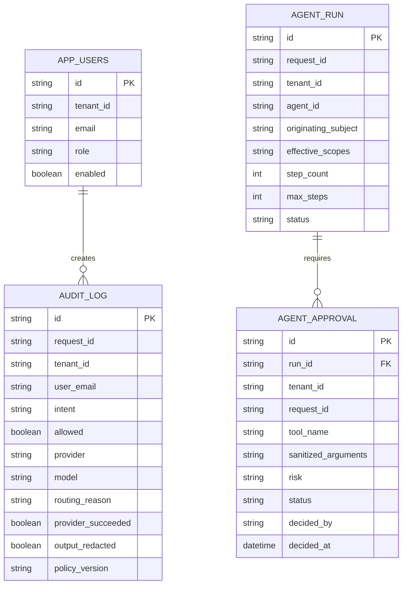

# AI Security Gateway — Low-Level Design

## 1. Component map

```mermaid
flowchart LR
    subgraph Web[Next.js frontend]
      Login[Login page]
      Chat[Chat page]
      Admin[Admin console]
    end

    subgraph API[Spring Boot API]
      Security[JWT resource server]
      Identity[IdentityResolver]
      ChatController[ChatController]
      AgentController[Agent controllers]
      AdminControllers[Admin controllers]
      ChatService[ChatService]
      DLP[RegexPiiDetector]
      Classifier[RuleBasedIntentClassifier]
      PDP[PolicyEngine]
      Router[PolicyAwareModelRouter]
      Executor[ProviderExecutor]
      Output[OutputInspector]
      ToolGateway[ToolGateway]
      Audit[AuditService]
    end

    subgraph Providers[ModelProvider implementations]
      CF[CloudflareWorkersAiProvider]
      OR[OpenRouterProvider]
      Gemini[GeminiProvider]
      HF[HuggingFaceClient]
      Ollama[OllamaClient]
      OpenAI[OpenAiProvider]
      Anthropic[AnthropicProvider]
    end

    subgraph Agent[Python agent runtime]
      FastAPI[FastAPI endpoints]
      Graph[LangGraph workflow]
      State[AgentState]
      GatewayClient[SecurityPlaneClient]
    end

    Login --> Security
    Chat --> ChatController
    Admin --> AdminControllers
    Security --> Identity
    ChatController --> ChatService
    ChatService --> DLP --> Classifier --> PDP --> Router --> Executor
    Executor --> Providers
    ChatService --> Output --> Audit
    AgentController <--> GatewayClient
    GatewayClient <--> Graph
    Graph --> State
    AgentController --> ToolGateway
```



## 2. Backend package responsibilities

| Package | Responsibility | Key types |
|---|---|---|
| `identity` | Convert validated JWT claims into server-authoritative identity and delegation context | `IdentityResolver`, `IdentityContext`, `DelegationChain`, `DevTokenController` |
| `iam` | Users, roles, ABAC/ReBAC checks and authoritative policy evaluation | `PolicyEngine`, `RelationshipAuthorizer`, `AppUserService` |
| `guard.pii` | Deterministic PII, secret and credential detection plus masking | `RegexPiiDetector`, `PiiResult`, `PiiEntity` |
| `guard.intent` | Deterministic workload/domain classification | `RuleBasedIntentClassifier`, `IntentClassification` |
| `guard.policy` | Policy request, resource, decision and obligation value types | `PolicyContext`, `PolicyDecision`, `PolicyObligation` |
| `routing` | Filter and order policy-eligible providers | `PolicyAwareModelRouter`, `RoutingDecision` |
| `provider` | Provider-neutral inference contracts, registry, fallback execution and circuit state | `ModelProvider`, `ProviderRegistry`, `ProviderExecutor` |
| `guard.output` | Inspect and redact model output before client delivery | `OutputInspector` |
| `chat` | Direct chat HTTP/SSE API and security pipeline orchestration | `ChatController`, `ChatService` |
| `agent` | Agent-run persistence, internal callbacks and approval lifecycle | `AgentExecutionService`, `AgentRun`, `AgentApproval` |
| `tool` | Tool registry, tenant/scope/DLP enforcement, approvals and result sanitization | `ToolGateway`, `ToolPolicyEngine`, `ToolRegistry` |
| `audit` | Durable PostgreSQL security audit | `AuditLog`, `AuditService`, `AuditController` |
| `observability` | Safe metrics, observations and pluggable security-event export | `AiTelemetry`, `SecurityEventPublisher` |
| `usage` | Rate limits and token-budget reservations | `RateLimitService`, `UsageBudgetService` |

## 3. Identity model



Identity invariants:

1. The JWT must already be cryptographically validated by Spring Security.
2. Tenant, role and identity type are reconstructed server-side.
3. Database role overrides a stale asserted role during chat processing.
4. Non-human actors require a delegator and the requested action scope.
5. Every child delegation scope set must be a subset of its parent.
6. Cross-tenant delegation is denied.

## 4. Direct-chat API

### `POST /api/chat`

Authenticated JSON request/response endpoint.

```json
{
  "sessionId": "s1",
  "messages": [
    { "role": "user", "content": "Hello" }
  ]
}
```

### `POST /api/chat/stream`

Authenticated SSE endpoint using the same request contract.

```text
event:token
data:Safe inspected response

event:done
data:[DONE]
```

The current implementation extracts the final user message. A future conversation service must validate and forward bounded history rather than trusting an arbitrary client transcript.

### Chat pipeline pseudocode

```text
identity = IdentityResolver.require(authentication)
user = AppUserService.getOrCreate(identity.tenant, identity.email, identity.role)
rateLimit.check(identity.tenant, identity.subject)

pii = RegexPiiDetector.detectAndMask(message)
safePrompt = pii.maskedText
intent = pii.hasPii ? PII : classifier.classify(safePrompt)
classification = classifyData(intent)
decision = policy.evaluate(identity, intent, classification)

if DENY:
    persist audit
    return safe denial

reservation = usage.reserve(tenant, safePrompt)
routing = router.select(intent, decision)
response = executor.execute(routing, ModelRequest(safePrompt, budget))
safeOutput = outputInspector.inspect(response)
persist authoritative audit
return safeOutput
```

## 5. Input-security behavior



Examples:

```text
8542098418                  -> [PHONE_1]
person@example.com          -> [EMAIL_1]
12.12.12.123                -> [IP_ADDRESS_1]
recognized API credential   -> [API_KEY_1]
```

PII receives `MASK_INPUT` and `INSPECT_OUTPUT`; approved cloud inference is permitted after deterministic masking. Secrets receive `REQUIRE_LOCAL_MODEL` and cannot use a cloud fallback.

## 6. Policy decision point



Evaluation order:

1. Validate context and tenant.
2. Validate delegation and effective scope.
3. Enforce tenant/ReBAC access.
4. Enforce residency attributes.
5. Deny security and prompt-injection intent.
6. Apply deterministic role/domain restrictions.
7. Attach masking, inspection, local-model, cost and audit obligations.

Policy outcomes must be deterministic and testable offline. Model output never changes an authorization decision.

## 7. Provider subsystem

### Contract

```java
public interface ModelProvider {
    String providerId();
    String modelId();
    boolean cloud();
    ProviderHealth health();
    ModelResponse generate(ModelRequest request);
    ModelResponse stream(ModelRequest request, Consumer<String> onToken);
}
```

### Provider implementations

| Provider ID | Adapter | Default model |
|---|---|---|
| `cloudflare` | OpenAI-compatible Workers AI endpoint | `@cf/google/gemma-4-26b-a4b-it` |
| `openrouter` | OpenAI-compatible endpoint | `openrouter/free` |
| `gemini` | Google OpenAI-compatible endpoint | `gemini-3.6-flash` |
| `huggingface` | Dedicated HF streaming adapter | `mistralai/Mistral-7B-Instruct-v0.2:featherless-ai` |
| `ollama` | Ollama native HTTP adapter | `llama3.2:1b` |
| `openai` | OpenAI-compatible endpoint | configured OpenAI model |
| `anthropic` | Anthropic message adapter | configured Claude model |

### Routing algorithm



Default production order:

```text
cloudflare -> openrouter -> gemini -> huggingface -> ollama
```

Actual provider, model, fallback reason, latency, token counts, cost and success status are persisted.

## 8. Agent execution APIs

| Endpoint | Caller | Purpose |
|---|---|---|
| `POST /api/agent/runs` | Authenticated UI | Create an agent execution |
| `GET /api/admin/agent-runs` | ADMIN | Tenant-scoped run list |
| `GET /api/admin/approvals` | ADMIN | Pending approvals |
| `GET /api/admin/approvals/history` | ADMIN | Approval audit history |
| `POST /api/admin/approvals/{id}/approve` | ADMIN | Approve and resume |
| `POST /api/admin/approvals/{id}/reject` | ADMIN | Reject and resume safely |
| Internal agent endpoints | LangGraph runtime | Context, inference, tool proposal and approved execution |

## 9. Agent state and graph

```text
requestId
tenantId
agentId
originatingSubject
delegationChain
effectiveScopes
messages
stepCount
maxSteps
pendingToolCall
approvalState
securityContext
```



## 10. Tool gateway



Mock GitHub tools:

| Tool | Action | Risk | Scope | Approval |
|---|---|---|---|---|
| `github.searchCode` | SEARCH | LOW | `github.read` | No |
| `github.readFile` | READ | LOW | `github.read` | No |
| `github.mergePullRequest` | WRITE | HIGH | `github.write` | Required |

The current merge handler is a deterministic mock. A real implementation should use a GitHub App installation token scoped to the selected repository; browser-supplied tokens must never be accepted.

## 11. Persistence



Tenant ID is mandatory on users, audits, agent runs and approvals. Admin reads are tenant-scoped.

## 12. Telemetry

`AiTelemetry` centralizes safe Micrometer observations. Recommended spans:

```text
ai.request
├── ai.security.input_scan
├── ai.intent.classify
├── ai.policy.evaluate
├── ai.model.route
├── ai.model.inference
└── ai.audit.persist

ai.agent.run
├── ai.agent.step
├── ai.tool.policy
├── ai.tool.execute
└── ai.agent.response
```

Allowed attributes include request ID, tenant ID, identity type, intent, classification, policy decision/version, provider/model, routing reason, tool metadata, token counts, cost and redaction flags. Prompts, credentials, JWTs and raw PII are prohibited.

## 13. Configuration contract

```env
DATABASE_URL=
DATABASE_USER=
DATABASE_PASSWORD=
JWT_SECRET=
JWT_ISSUER=ai-security-gateway
DEV_TOKEN_ENABLED=false

MODEL_PROVIDER_PRIORITY=cloudflare,openrouter,gemini,huggingface,ollama
ALLOW_CLOUD_FALLBACK=true
DEFAULT_TOKEN_BUDGET=512
PROVIDER_TIMEOUT_SECONDS=45

CLOUDFLARE_API_TOKEN=
CLOUDFLARE_ACCOUNT_ID=
CLOUDFLARE_MODEL=@cf/google/gemma-4-26b-a4b-it
OPENROUTER_API_KEY=
OPENROUTER_MODEL=openrouter/free
GEMINI_API_KEY=
GEMINI_MODEL=gemini-3.6-flash
HF_TOKEN=

AGENT_RUNTIME_URL=
AGENT_RUNTIME_TOKEN=
AI_OBSERVABILITY_ENABLED=false
AI_OBSERVABILITY_LANGSMITH_ENABLED=false
OTEL_EXPORTER_OTLP_TRACES_ENDPOINT=
```

All values that authenticate or authorize access are server-side secrets and must be supplied through environment/secret management, never committed.

## 14. Error behavior

| Failure | Required behavior |
|---|---|
| Invalid/expired JWT | `401`; frontend should clear session and return to login |
| Tenant resolution failure | Reject request |
| PDP failure | Deny protected action |
| PII detected | Mask, inspect output, use policy-approved provider |
| Secret detected | Mask and require private/local model |
| Required local provider unavailable | Safe failure; no cloud fallback |
| Cloud provider failure | Ordered fallback only when permitted |
| Empty provider completion | Treat as provider failure |
| Tool registry failure | Do not execute |
| Approval store failure | Do not execute approval-required tool |
| Changed policy after approval | Reauthorization denial |
| Audit exporter failure | Preserve durable request behavior; meter exporter failure |

## 15. Known implementation gaps

1. Direct chat does not yet pass bounded multi-turn history to `ModelProvider`.
2. SSE output is buffered until output inspection completes; it is not token-by-token client delivery.
3. Ollama needs an active connectivity health probe.
4. Provider health currently validates configuration more than remote inference readiness.
5. GitHub execution is mock-only.
6. Development email JWT login must be disabled when production OIDC is configured.
7. The agent-runtime deployment and durable LangGraph checkpoint store need production deployment configuration.
